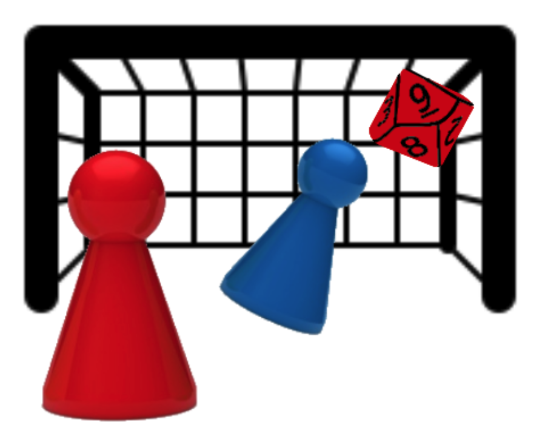
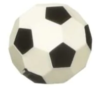
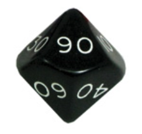
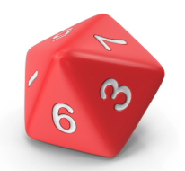
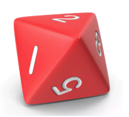
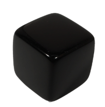
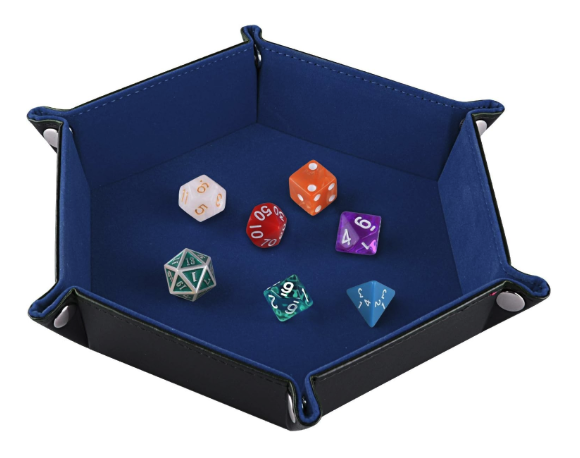

# FOOTROLL

Footroll is a turn-based football (soccer) simulation board game designed for two players, offering a highly realistic gameplay experience. By combining a comprehensive set of rules, unique skill sets, and dice rolls, the game meticulously reproduces a wide range of football match scenarios. Footroll emphasizes the importance of tactics, player positioning, and playing styles in the game's development. Players resolve actions through dice rolls and straightforward calculations, easily performed with a regular calculator. This intricate yet accessible system ensures that each match is both strategic and engaging.

#### **Created by Aleix Puig Sitjes**

## Rulebook
Footroll is released in two editions:
- **Footroll Advanced**
- **Footroll Simplified**

## Cheat Sheets
### Mechanics Cheat Sheet
### Action Cheat Sheet
### Teams Cheat Sheet

## How To Build Your Footroll Board Game

### The pitch
The pitch must be printed at scale 1 yard : 8 mm. The pitch must have a grid of black cells of 8 mm with a line width smaller than the regular lines which must be printed in white. The size of the pitch is not fixed but FIFA recommends a pitch size of 114x74 yards. However, this is a rather large pitch and it is recommended to play footroll in a smaller pitch (100 x 64 yards) to make the game play more fun. The pitch can be printed in color or in black and white (with inverted colors). Of course, the second option is cheaper. It is recommended to laminate it for better protection.

### The pawns
The pawns must be 8 mm in diameter to fit in one cell of the grid. The pawns should be ideally non-conical. You must have at least 2 teams of different colors with 18 pawns each. Use 2 numbered 8 mm color stickers on each pawn. Use a combination of colors that match your team’s colors.

### The Ball
The ball must be 8 mm in diameter.

### The Dice
Footroll requires the following dice:

- 2 x 10-sided dice for tens

- 2 x 10-sided dice for units

- 2 x 8-sided dice 

- 1 custom black 6-sided dice for fouls. Stick one yellow sticker on top of a red sticker on 2 sides of the dice and leave the remaining 4 sides empty.

- 1 custom black 6-sided dice for cards and injuries. Stick a red sticker on 2 sides and a yellow sticker on the remaining 4 sides.

It is recommended to use two dice trays to prevent messing up the gameplay when rolling dice.

### The Team
- Print 2 copies for each team’s table: one for each player.
- Print 2 copies of the Action Cheat Sheet, one for each player.
- Footroll requires some calculations that can be performed with a regular calculator that can be found on any smartphone.

## Tutorials
## Apps
### Footroll Pitch Creator
### Footroll Simulator
### Footroll Assistant

## License
#### [**Attribution-NonCommercial-ShareAlike 4.0 International**](https://creativecommons.org/licenses/by-nc-sa/4.0/legalcode) 
#### [**(CC BY-NC-SA 4.0)**](https://creativecommons.org/licenses/by-nc-sa/4.0/legalcode)

